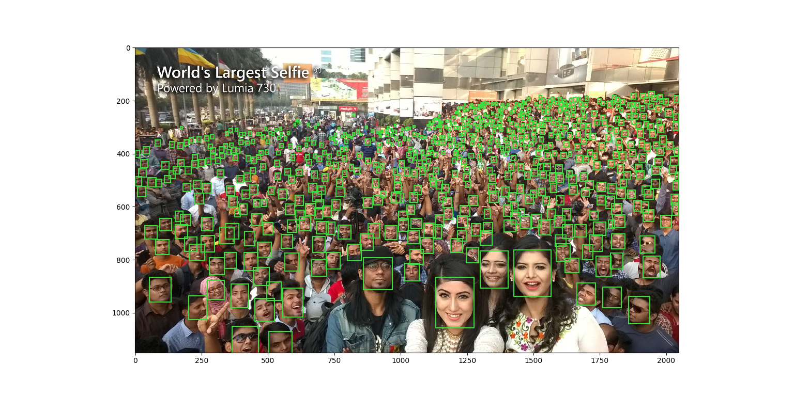

## Description
This work is to reproduce S³FD, a real-time Single Shot Scale-invariant Face Detector.


## Environment
* [mxnet](https://github.com/apache/incubator-mxnet) 1.3.0
* [gluon-cv](https://github.com/dmlc/gluon-cv) 0.4.0
* [MobulaOP](https://github.com/wkcn/MobulaOP) required to build custom c++ operator

## Preparation

```
# install MobulaOP following: https://github.com/wkcn/MobulaOP
$$ git clone https://github.com/yangfly/sfd.gluoncv.git
$$ cd sfd.gluoncv
```

## Training your own model
1. download [wider face](http://mmlab.ie.cuhk.edu.hk/projects/WIDERFace/) dataset into `widerface/downloads/`
    ```
    $$ tree widerface/downloads
    widerface/downloads
    ├── eval_tools.zip
    ├── Submission_example.zip
    ├── wider_face_split.zip
    ├── WIDER_test.zip
    ├── WIDER_train.zip
    └── WIDER_val.zip
    ```
2. Parpare data: unzip data, annotations and eval_tools
    ```
    $$ python tool/parpare.py
    $$ tree widerface -L 1
    widerface
    ├── downloads
    ├── eval_tools
    ├── wider_face_split
    ├── WIDER_train
    └── WIDER_val
    ```
3. Prepare custom val dataset for quick validation (crop and resize to 640)
    ```
    $$ python tool/build_custom_val.py
    $$ tree widerface -L 1
    widerface
    ├── downloads
    ├── eval_tools
    ├── WIDER_custom
    ├── wider_face_split
    ├── WIDER_train
    └── WIDER_val
    ```
4. train vgg16 based sfd with 4 gpus
    ```
    $$ python sfd/train.py
    ```
    more supported base models in `sfd/nn/sfd.py`
5. demo
    ```
    $$ python sfd/demo.py --model models/vgg16/sfd_best.params
    ```
6. eval on WIDER_val
    ```
    $$ python sfd/eval.py --model models/vgg16/sfd_best.params
    ```
